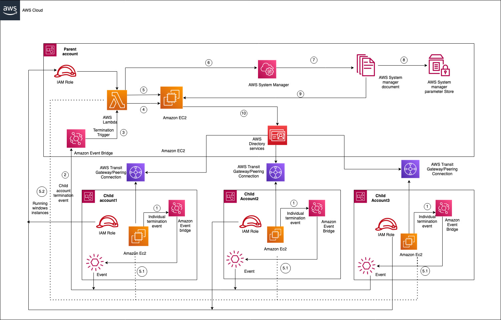

# AD Cleanup automation using Lambda for multiple accounts

[Active Directory](https://www.n-able.com/blog/difference-between-ldap-ad) is a Microsoft scripting tool that manages domain information and user interactions with network services. It’s widely used among managed services providers (MSPs) to [manage employee credentials and access permissions](https://www.n-able.com/blog/free-permissions-analyzer-tool-active-directory).Since Active directory attackers can use inactive accounts to try and hack into an organization. It is important to find these inactive accounts and disable them on a routine maintenance schedule. This APG can quickly find inactive accounts and remove them. So that it will always keep AD secure and updated.

## Target Architecture



## Prerequisites

1. An active parent AWS account and one or multiple child accounts.
2. Terraform installed and configured. For more information about this , refer this documentation
3.  Directory service should be available in parent account and share that to all the child accounts. If not please refer [here](https://docs.aws.amazon.com/directoryservice/latest/admin-guide/ms_ad_tutorial_directory_sharing.html) to create the same.
4.  VPC peering or AWS Transit gateway connection should be available between VPC of the Directory services (parent account) and VPC of the EC2 instances (Child account). If not , refer this [documentation](https://docs.aws.amazon.com/directoryservice/latest/admin-guide/step1_setup_networking.html) and implement the same. 
5. Amazon EC2 Windows Computer should be created with EC2WindowsUserdata script on all the parent and child accounts. Script file is available in root of the code repository.
6. Cross account role should be available on each of the child account and it should be having trust policy to allow lambda function from parent account to use. If not refer [link](https://docs.aws.amazon.com/AmazonCloudWatch/latest/events/CloudWatchEvents-CrossAccountEventDelivery.html) to implement the same. 
7. Below secrets values should be available in AWS Systems Manager(SSM) parameter store of parent account
    domainJoinUser - Username of the directory service 
    domainJoinPassword - Password of the directory service


## Execution Flow

1. In Child Accounts, Amazon Event Bridge rule has been configured to collect all the Amazon EC2 termination events.It sends those events to Amazon Event Bridge which is present in parent account.
2. Amazon Event Bridge from parent account collects all these events and have the rule to trigger the AWS Lambda function.
3. Once parent account receives any termination events either from parent or child account , it triggers the AWS Lambda function.
4. When AWS Lambda function ( Python 3.8 ) gets triggered , it makes the call to Amazon EC2(Elastic Compute Cloud) Auto Scaling Groups using python boto module and get the random instance id . This is the instance id which we are going to use it to execute SSM commands.
5. AWS Lambda makes another call to Amazon EC2 using boto module and get the private IP addresses of the running windows servers and stores into temporary variable. 5.1 and 5.2 steps are collecting running windows ec2 instances from child accounts.
6. AWS Lambda makes another call to AWS System Manager to get the computer information which are connected to AWS Directory Service.
7. AWS System Manager document helps to execute the powershell command on Amazon EC2 windows server(Instance id which we are getting from step 2) to get the private IP addresses of the computers which are connected with the AD.
8. AD domain username and password is stored in AWS System Manager parameter store. Lambda and SSM makes call to parameter store and get these values to use that to connect AD.
9. With the help of AWS System Manager document , Powershell command will be executed on Amazon EC2 Windows server(Instance id which we are getting from step 2)
10. Amazon EC2 connects AWS Directory Service via Powershell commands and remove the computers which are not in use or inactive.


## Deployment

```
terraform init
terraform plan —-var-file=examples/terraform.tfvars
terraform apply —-var-file=examples/terraform.tfvars

```
## Security

See [CONTRIBUTING](CONTRIBUTING.md#security-issue-notifications) for more information.

## License

This library is licensed under the MIT-0 License. See the LICENSE file.
