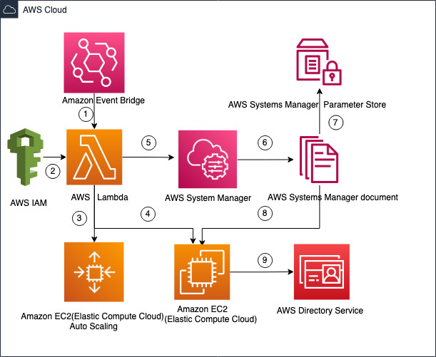

# AD Cleanup automation using Lambda for single account

[Active Directory](https://www.n-able.com/blog/difference-between-ldap-ad) is a Microsoft scripting tool that manages domain information and user interactions with network services. It’s widely used among managed services providers (MSPs) to [manage employee credentials and access permissions](https://www.n-able.com/blog/free-permissions-analyzer-tool-active-directory).Since Active directory attackers can use inactive accounts to try and hack into an organization. It is important to find these inactive accounts and disable them on a routine maintenance schedule. This APG can quickly find inactive accounts and remove them. So that it will always keep AD secure and updated.

## Target Architecture



## Execution Flow

1. Amazon Event Bridge triggers the AWS Lambda function based on the cron timings. (Per day once for this use case)

2. Required IAM role and policy will be created and attached into AWS Lambda via terraform.

3. When AWS Lambda function( Python 3.8 ) gets executed , it makes the call to Amazon EC2(Elastic Compute Cloud) Auto Scaling Groups using python boto module and get the random instance id . This is the instance id which we are going to use it to execute SSM commands.

4.  AWS Lambda makes another call to Amazon EC2 using boto module and get the private IP addresses of the running windows servers and stores into temporary variable.

5. AWS Lambda makes another call to AWS system manager to get the computer information which are connected to AWS Directory Service.

6. AWS System Manager document helps to execute the powershell script on Amazon EC2 windows servers to get the private IP addresses of the computers which are connected with AD.

7. AD domain username and passwords are stored in AWS System Manager parameter store. Lambda and SSM makes call to parameter store and get these values to use that to connect AD.

8. With the help of AWS System Manager document , Powershell script will be executed on Amazon EC2 Windows server(Instance id which we are getting from step 2)

9. Amazon EC2 connects AWS Directory Service via powershell commands and remove the computers which are not in use or inactive.

## Prerequisites

1. An active AWS account
2. Terraform installed and configured. For more information about this , refer this documentation
3. Windows Computer with ActiveDirectory modules
4. Create Directory service
5. Create below secrets into SSM parameter store.
    - domainJoinUser - Username of the directory service
    - domainJoinPassword - password of the directory service

## Deployment

```
terraform init
terraform plan
terraform apply

```
## Security

See [CONTRIBUTING](CONTRIBUTING.md#security-issue-notifications) for more information.

## License

This library is licensed under the MIT-0 License. See the LICENSE file.
